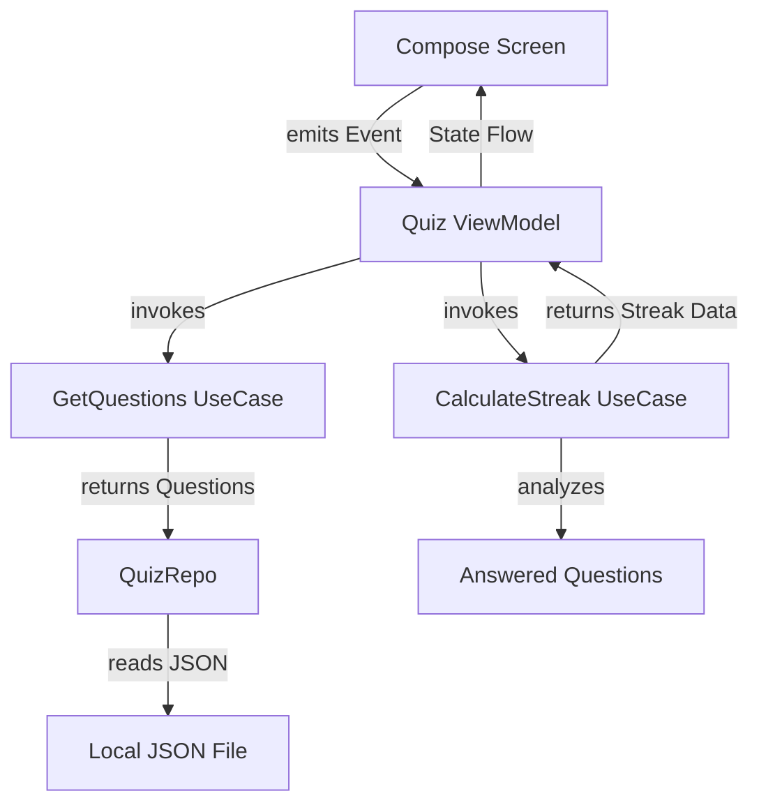

# 🎯 Quiz App

A modern quiz application built with **Jetpack Compose** and **MVI architecture**, featuring smooth animations, streak tracking, and comprehensive results analysis.

## 🛠️ **Tech Stack**

- **Jetpack Compose** – Declarative UI
- **MVI Architecture** – For unidirectional data flow and better state management
- **Minimum SDK**: Android 8 (API Level 26)

## 🧩 **Dependencies Used**

| Purpose | Library | Notes |
|---------|---------|-------|
| Dependency Injection | Hilt | DI |
| Serialization | Kotlinx Serialization | Decode/Encode JSON |
| State Management | StateFlow | Reactive state management |
| Asynchronous Operations | Coroutines | Background processing |
| UI Framework | Jetpack Compose | Modern UI toolkit |
| Navigation | Compose Navigation | Screen transitions |
| Design System | Material 3 | Modern theming |

## 🧪 **Features / Requirements**

This app supports the following quiz functionality:

1. **Question Loading**
   ➤ Loads 10 questions from JSON file with answer shuffling.

2. **Answer Selection**
   ➤ Select answer options with immediate visual feedback and streak tracking.

3. **Results Analysis**
   ➤ Comprehensive results screen showing performance metrics, streak analysis, and question review.

## 📱 **UI Structure**

### 🔍 **Loading Screen**

Initial screen that includes:
1. **Animated Logo** – Pulsing animation with app branding
2. **Loading Progress** – Smooth transition to quiz interface
3. **Background Setup** – Prepares questions and initial state

### 🎯 **Question Screen**

Main quiz interface featuring:
1. **Progress Indicator** – Shows current question number and overall progress
2. **Question Display** – Clean presentation of question text
3. **Answer Options** – Interactive cards with selection feedback
4. **Streak Badge** – Visual indicator for consecutive correct answers (3+ streak)
5. **Skip Option** – Allows users to skip difficult questions

### 📊 **Results Screen**

Comprehensive analysis including:
1. **Score Summary** – Final score and percentage
2. **Streak Analysis** – Current and longest streak achieved
3. **Question Review** – Detailed breakdown of all answers
4. **Performance Metrics** – Statistics and insights
5. **Restart Option** – Begin new quiz session

## ⚙️ **Architecture Overview**

This project follows the **MVI pattern**. Here's a summary of the QuizContract:

### 🎛️ **State Management**

```kotlin
data class State(
    val questions: List<Question> = emptyList(),
    val currentQuestionIndex: Int = 0,
    val selectedOptionIndex: Int? = null,
    val isAnswerRevealed: Boolean = false,
    val answeredQuestions: List<AnsweredQuestion> = emptyList(),
    val currentStreak: Int = 0,
    val longestStreak: Int = 0,
    val isQuizCompleted: Boolean = false,
    val isLoading: Boolean = false
)
```

- **questions**: List of quiz questions loaded from JSON
- **currentQuestionIndex**: Index of currently displayed question
- **selectedOptionIndex**: User's selected answer option
- **isAnswerRevealed**: Controls answer feedback visibility
- **answeredQuestions**: History of all answered questions
- **currentStreak**: Current consecutive correct answers
- **longestStreak**: Best streak achieved in current session
- **isQuizCompleted**: Quiz completion status
- **isLoading**: Loading state for UI feedback

### 🔄 **Events**

```kotlin
sealed class Event {
    data class SelectOption(val optionIndex: Int) : Event()
    object NextQuestion : Event()
    object SkipQuestion : Event()
    object RestartQuiz : Event()
}
```

### ⚠️ **Effects**

```kotlin
sealed class Effect {
    object ShowToast(val message: String) : Effect()
    object ShowError : Effect()
}
```

### 🧪 **Testing**

Tests are implemented using the following tools:

- **MockK** – Mocking library for Kotlin
- **AssertK** – Fluent assertions
- **Robolectric** – Run Android tests on JVM
- **Turbine** – Test Kotlin Flow emissions

## 🏗 **High‑Level Architecture**



## **QuizViewModel**

1. Holds an immutable State object exposed via StateFlow.
2. Receives UI Events, calls UseCases, and updates state.
3. Sends one‑off Effects through SharedFlow (ShowError, navigation events).

```kotlin
fun handleEvent(event: Event) = when (event) {
    Event.NextQuestion -> moveToNextQuestion(false)
    Event.RestartQuiz -> restartQuiz()
    is Event.SelectOption -> selectOption(event.optionIndex)
    Event.SkipQuestion -> moveToNextQuestion(true)
}
```

## **QuizRepo**

1. Reads questions from local JSON file in raw resources.
2. Parses JSON using Kotlinx Serialization.
3. Returns typed Result<List<Question>> with proper error handling.

## **GetQuestionsUseCase**

1. Fetches questions from repository.
2. Applies business logic (shuffling, filtering).
3. Returns processed questions ready for UI consumption.

## **CalculateStreakUseCase**

1. Analyzes answered questions for streak patterns.
2. Calculates current and longest streaks.
3. Provides real-time streak updates during quiz.
