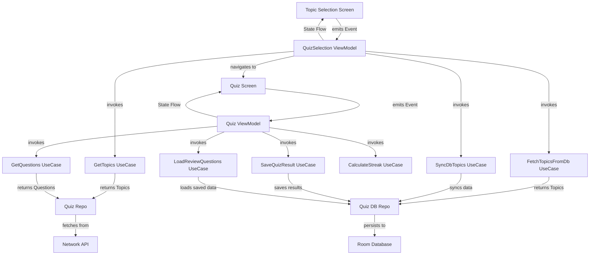

# 🎯 Quiz App

A modern quiz application built with **Jetpack Compose** and **MVI architecture**, featuring smooth animations, streak tracking, comprehensive results analysis, and topic-based quiz selection with offline capabilities.

## 🛠️ **Tech Stack**

- **Jetpack Compose** – Declarative UI
- **MVI Architecture** – For unidirectional data flow and better state management
- **Room Database** – Local data persistence and offline capabilities
- **Koin** – Dependency injection framework
- **Minimum SDK**: Android 8 (API Level 26)

## 🧩 **Dependencies Used**

| Purpose | Library | Notes |
|---------|---------|-------|
| Dependency Injection | Koin | DI framework |
| Database | Room | Local SQLite database |
| Serialization | Kotlinx Serialization | Decode/Encode JSON |
| State Management | StateFlow | Reactive state management |
| Asynchronous Operations | Coroutines | Background processing |
| UI Framework | Jetpack Compose | Modern UI toolkit |
| Navigation | Compose Navigation | Screen transitions with type safety |
| Design System | Material 3 | Modern theming |

## 🧪 **Features / Requirements**

This app supports the following quiz functionality:

1. **Topic Selection**
   ➤ Browse available quiz topics with completion status and best streak display.

2. **Question Loading**
   ➤ Loads questions from network with fallback to local database for offline support.

3. **Answer Selection**
   ➤ Select answer options with immediate visual feedback and streak tracking.

4. **Results Analysis**
   ➤ Comprehensive results screen showing performance metrics, streak analysis, and question review.

5. **Offline Support**
   ➤ Quiz data persisted locally for offline access and review functionality.

6. **Review Mode**
   ➤ Review previously completed quizzes with saved answers and performance metrics.

## 📱 **UI Structure**

### 🔍 **Topic Selection Screen**

Initial screen for topic browsing:
1. **Topic Cards** – Display available quiz topics with completion indicators
2. **Progress Indicators** – Show completion status and best streaks
3. **Review Access** – Quick access to review completed quizzes
4. **Network Status** – Handles online/offline states gracefully

### 🎯 **Question Screen**

Main quiz interface featuring:
1. **Progress Indicator** – Shows current question number and overall progress
2. **Question Display** – Clean presentation of question text
3. **Answer Options** – Interactive cards with selection feedback
4. **Streak Badge** – Visual indicator for consecutive correct answers (3+ streak)
5. **Skip Option** – Allows users to skip difficult questions

### 📊 **Results Screen**

Comprehensive analysis including:
1. **Score Summary** – Final score and percentage
2. **Streak Analysis** – Current and longest streak achieved
3. **Question Review** – Detailed breakdown of all answers
4. **Performance Metrics** – Statistics and insights
5. **Navigation Options** – Return to topic selection or review answers

## ⚙️ **Architecture Overview**

This project follows the **MVI pattern** with a multi-screen architecture supporting topic selection and quiz functionality.

### 🎛️ **Quiz State Management**

```kotlin
data class State(
    val questions: List<Question> = emptyList(),
    val currentQuestionIndex: Int = 0,
    val selectedOptionIndex: Int? = null,
    val isAnswerRevealed: Boolean = false,
    val answeredQuestions: List<AnsweredQuestion> = emptyList(),
    val currentStreak: Int = 0,
    val longestStreak: Int = 0,
    val isQuizCompleted: Boolean = false,
    val currentTopic: Topic = Topic(),
    val showReview: Boolean = false
)
```

### 🔄 **Events**

```kotlin
sealed class Event {
    data class FetchQuestions(val topic: Topic) : Event()
    data class ShowReview(val topic: Topic) : Event()
    data class SelectOption(val optionIndex: Int) : Event()
    object NextQuestion : Event()
    object SkipQuestion : Event()
    object OnBackPress : Event()
}
```

### ⚠️ **Effects**

```kotlin
sealed class Effect {
    data class ShowToast(val message: String) : Effect()
    object ShowError : Effect()
    sealed class Navigation : Effect() {
        object OnBackPress : Navigation()
    }
}
```

### 🏗 **High‑Level Architecture**



## **Use Cases**

### **Topic Management Use Cases**

#### **GetTopicsUseCase**
Fetches quiz topics from network API with error handling.

```kotlin
class GetTopicsUseCase(
    private val dataRepo: QuizRepo
) {
    suspend operator fun invoke(): Result<List<Topic>> {
        return dataRepo.fetchQuizTopics()
    }
}
```

#### **FetchTopicsFromDbUseCase**
Retrieves all topics from local database for offline access.

```kotlin
class FetchTopicsFromDbUseCase(
    private val quizDbRepo: QuizDBRepo
) {
    suspend operator fun invoke(): List<TopicEntity> {
        return quizDbRepo.getAllTopics()
    }
}
```

#### **SyncDbTopicsUseCase**
Synchronizes network topics with local database.

```kotlin
class SyncDbTopicsUseCase(
    private val quizDbRepo: QuizDBRepo
) {
    suspend operator fun invoke(topics: List<Topic>): Result<Unit> {
        return try {
            quizDbRepo.syncTopics(topics)
            Result.success(Unit)
        } catch (e: Exception) {
            Result.failure(e)
        }
    }
}
```

### **Quiz Management Use Cases**

#### **SaveQuizResultUseCase**
Persists quiz results including questions, answers, and streak data.

```kotlin
class SaveQuizResultUseCase(
    private val quizDbRepo: QuizDBRepo
) {
    suspend operator fun invoke(
        topicId: String,
        questions: List<Question>,
        userAnswers: Map<Int, String>,
        bestStreak: Int
    ) {
        quizDbRepo.completeTopicAndSaveQuestions(topicId, questions, userAnswers, bestStreak)
    }
}
```

#### **LoadReviewQuestionsUseCase**
Loads saved quiz data for review functionality.

```kotlin
class LoadReviewQuestionsUseCase(
    private val quizDbRepo: QuizDBRepo
) {
    suspend operator fun invoke(topicId: String): List<Pair<Question, AnsweredQuestion>> {
        val savedQuestions = quizDbRepo.getAllQuestionsForTopic(topicId)
        if (savedQuestions.isEmpty()) {
            throw Exception("No saved questions found for topic $topicId")
        }
        return savedQuestions.map { entity ->
            // Map database entities to domain models
            Pair(question, answeredQuestion)
        }
    }
}
```

## **ViewModels**

### **QuizSelectionViewModel**

Manages topic selection screen state and navigation:

1. Fetches topics from network with fallback to database
2. Handles topic synchronization between network and local storage
3. Manages loading states and error handling
4. Provides navigation to quiz screen with review mode support

```kotlin
fun handleEvent(event: Event) {
    when(event) {
        is Event.OnTopicSelected -> {
            setEffect { NavigateToQuiz(event.topic, false) }
        }
        is Event.OnReviewClicked -> {
            setEffect { NavigateToQuiz(event.topic, true) }
        }
        Event.UpdateTopicStatus -> {
            viewModelScope.launch { loadTopicsFromDb() }
        }
        Event.OnBackPress -> setEffect { Effect.Navigation.OnBackPress }
    }
}
```

### **QuizViewModel**

Manages quiz flow and question state:

1. Loads questions based on selected topic
2. Handles answer selection and streak calculation
3. Manages quiz completion and result saving
4. Supports review mode for completed quizzes

```kotlin
fun handleEvent(event: Event) {
    when (event) {
        is Event.FetchQuestions -> {
            setState { copy(currentTopic = event.topic) }
            loadQuestions(event.topic.url)
        }
        is Event.ShowReview -> {
            setState { copy(currentTopic = event.topic, showReview = true) }
            loadReviewQuestions()
        }
        Event.NextQuestion -> moveToNextQuestion(false)
        is Event.SelectOption -> selectOption(event.optionIndex)
        Event.SkipQuestion -> moveToNextQuestion(true)
        Event.OnBackPress -> setEffect { Effect.Navigation.OnBackPress }
    }
}
```

## **Navigation**

The app uses Compose Navigation with type-safe routing:

### **Navigation Structure**
- **QuizSelection Screen** → Topic browsing and selection
- **Quiz Screen** → Question display and interaction

### **Navigation Implementation**
```kotlin
NavHost(navController = navController, startDestination = Screens.QuizSelection) {
    composable<Screens.QuizSelection> {
        // Topic selection screen with navigation to quiz
    }
    composable<Screens.Quiz> {
        // Quiz screen with review mode support
    }
}
```

## **Data Flow**

### **Online Flow**
1. Fetch topics from network API
2. Sync topics to local database
3. Display topics with completion status
4. Load questions from network for selected topic
5. Save quiz results to database

### **Offline Flow**
1. Load topics from local database
2. Display cached topic data
3. Load review questions from database
4. Support offline quiz review functionality

### 🧪 **Testing**

Tests are implemented using the following tools:

- **MockK** – Mocking library for Kotlin
- **AssertK** – Fluent assertions
- **Robolectric** – Run Android tests on JVM
- **Turbine** – Test Kotlin Flow emissions

## **Key Improvements**

1. **Offline Support** – Full offline capabilities with local database
2. **Topic Management** – Structured topic selection and management
3. **Review Functionality** – Review completed quizzes with saved data
4. **Enhanced Architecture** – Separation of concerns with dedicated use cases
5. **Type-Safe Navigation** – Modern Compose navigation with type safety
6. **Robust Error Handling** – Graceful fallbacks and error states